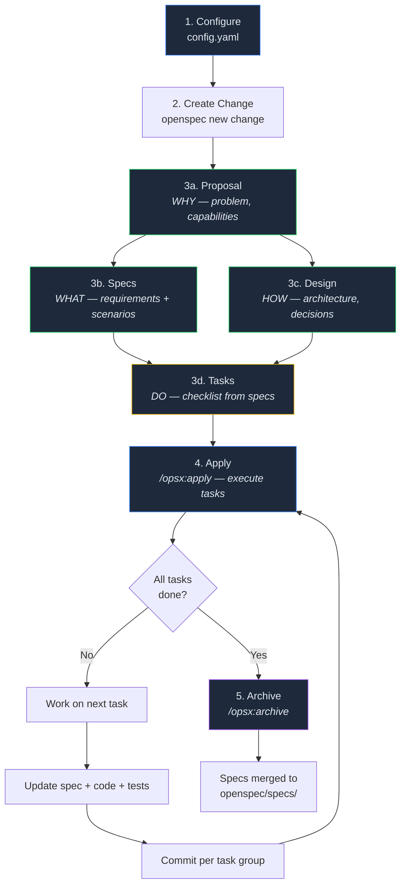
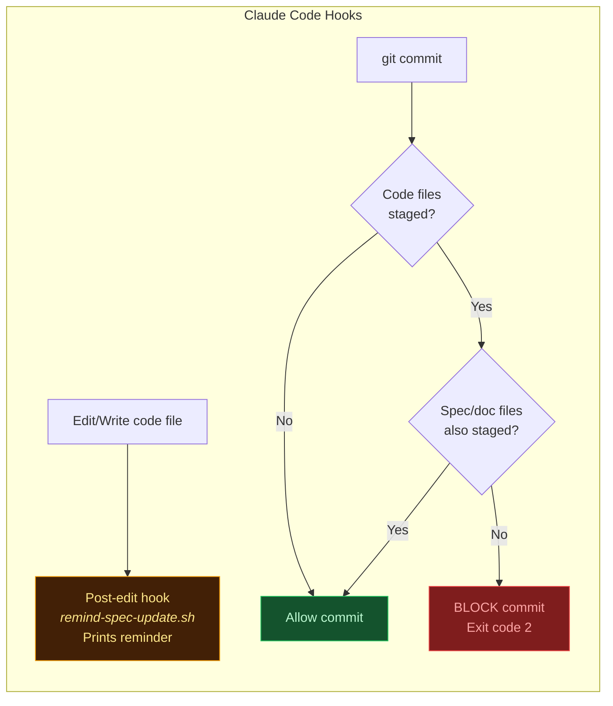

# OpenSpec Workflow — Spec-Driven Development

This document explains the OpenSpec workflow, enforcement hooks, and best practices for the NPS Insight Engine project.

---

## What is OpenSpec?

OpenSpec is a spec-driven development tool that structures work into **changes** — self-contained units with standardized artifacts. It uses the `spec-driven` schema that defines what artifacts are needed and in what order.

---

## Workflow Diagram



### Enforcement During the Workflow



---

## The Schema: `spec-driven`

The schema requires 4 artifacts created in dependency order:

| # | Artifact | Purpose | Depends On | Command |
|---|----------|---------|------------|---------|
| 1 | `proposal.md` | **WHY** — problem, capabilities list | Nothing | `openspec instructions proposal` |
| 2 | `specs/**/*.md` | **WHAT** — requirements with WHEN/THEN scenarios | proposal | `openspec instructions specs` |
| 3 | `design.md` | **HOW** — architecture, decisions, trade-offs | proposal | `openspec instructions design` |
| 4 | `tasks.md` | **DO** — implementation checklist with checkboxes | specs + design | `openspec instructions tasks` |

---

## Steps

### Step 1: Configure OpenSpec Context

**File:** `openspec/config.yaml`

```yaml
schema: spec-driven
context: |
  Project: NPS Insight Engine
  Tech stack: Next.js 15, React 19, TypeScript, Tailwind CSS 4
  ...
rules:
  proposal:
    - Always include a "Non-goals" section
  tasks:
    - Break tasks into chunks of max 4 hours
    - Each task should be independently testable
    - Include verification steps in each task
    - Commit changes after completing each task group
```

### Step 2: Create a New Change

```bash
openspec new change "feature-name"
```

Creates a scaffolded directory at `openspec/changes/feature-name/` with a `.openspec.yaml` file that tracks artifact status.

### Step 3: Check Status

```bash
openspec status --change "feature-name" --json
```

Shows which artifacts are `ready`, `blocked`, or `done`.

### Step 4: Get Instructions for Each Artifact

```bash
openspec instructions <artifact-id> --change "feature-name" --json
```

Returns:
- `template` — structure/skeleton for the file
- `instruction` — guidelines on what to include
- `context` — project context from config.yaml
- `rules` — artifact-specific rules
- `dependencies` — completed artifacts to read for context
- `outputPath` — where to write the file

### Step 5: Create Artifacts in Dependency Order

#### 5a. Proposal (`proposal.md`)

Created first — no dependencies. Defines:
- **Why** — problem statement
- **What Changes** — bullet list of changes
- **Non-Goals** — out of scope
- **Capabilities** — list of new capabilities (each becomes a spec file)

#### 5b. Specs (`specs/`) + Design (`design.md`)

Created in parallel — both depend only on the proposal.

**Specs** — one file per capability:
```markdown
## ADDED Requirements

### Requirement: User can create a new project
The system SHALL allow users to create a new project.

#### Scenario: Successful project creation
- **WHEN** user fills in tool name and clicks "Create"
- **THEN** system creates a project and redirects to upload page

#### Scenario: Missing required fields
- **WHEN** user submits with empty tool name
- **THEN** system displays a validation error
```

Rules:
- Use `SHALL` / `MUST` for normative requirements
- Every requirement needs at least one `#### Scenario:` with WHEN/THEN
- Scenarios are testable — each can become a test case
- Unimplemented features are marked `(NOT YET IMPLEMENTED)` in the scenario title

**Design** — architecture decisions, data flow, risks.

#### 5c. Tasks (`tasks.md`)

Created last — depends on specs + design.

```markdown
## 1. Setup
- [ ] 1.1 Create new module structure
- [ ] 1.2 Add dependencies to package.json

## 2. Core Implementation
- [ ] 2.1 Implement data export function
- [ ] 2.2 Add CSV formatting utilities
```

Rules:
- Checkbox format (`- [ ]`) is required — OpenSpec parses these
- Tasks should be max 4 hours, independently testable
- Each spec scenario should map to one or more tasks
- Group related tasks under `## N. Group Name` headings

### Step 6: Implement via Apply

```bash
/opsx:apply
```

Reads `tasks.md`, shows progress, walks through each pending task. For each task:
1. Update the spec if needed
2. Write the code
3. Write/update tests
4. Mark the task checkbox: `- [ ]` → `- [x]`
5. Commit per task group

### Step 7: Archive

```bash
/opsx:archive
```

Merges completed specs from `openspec/changes/*/specs/` into `openspec/specs/` (the canonical spec directory).

---

## Enforcement — Claude Code Hooks

Two hooks in `.claude/settings.json` enforce the spec-first workflow:

### Hook 1: Pre-Commit Blocker (`enforce-spec-update.sh`)

**Location:** `.claude/hooks/enforce-spec-update.sh`
**Trigger:** `PreToolUse` on any `Bash` command matching `git commit`
**Behavior:** **BLOCKS** the commit (exit code 2) if code files are staged without spec/doc files

**How it works:**
1. Extracts the git command from Claude Code's JSON input
2. Skips check for commits prefixed with `docs:` or `chore:` or containing "merge"
3. Gets staged files via `git diff --cached --name-only`
4. Checks if any code files are staged (`app/`, `lib/`, `components/`)
5. If code changed, requires at least one spec/doc file also staged (`openspec/`, `README.md`, `CLAUDE.md`)
6. If missing: prints error with list of offending files and exits with code 2

**Configuration in `.claude/settings.json`:**
```json
{
  "hooks": {
    "PreToolUse": [
      {
        "matcher": "Bash",
        "hooks": [
          {
            "type": "command",
            "command": "\"$CLAUDE_PROJECT_DIR\"/.claude/hooks/enforce-spec-update.sh"
          }
        ]
      }
    ]
  }
}
```

### Hook 2: Post-Edit Reminder (`remind-spec-update.sh`)

**Location:** `.claude/hooks/remind-spec-update.sh`
**Trigger:** `PostToolUse` on `Edit` or `Write` tool calls
**Behavior:** **REMINDS** (non-blocking, exit code 0) to update specs after editing code files

**How it works:**
1. Extracts the file path from Claude Code's JSON input
2. If the file is in `app/`, `lib/`, or `components/`, prints a reminder to stderr
3. Always exits 0 — never blocks work

**Configuration in `.claude/settings.json`:**
```json
{
  "hooks": {
    "PostToolUse": [
      {
        "matcher": "Edit|Write",
        "hooks": [
          {
            "type": "command",
            "command": "\"$CLAUDE_PROJECT_DIR\"/.claude/hooks/remind-spec-update.sh"
          }
        ]
      }
    ]
  }
}
```

### What's Enforced vs. What Requires Discipline

| Rule | Enforced? | How |
|------|-----------|-----|
| Specs included with code commits | Yes | Pre-commit hook blocks |
| Reminded to update specs after edits | Yes | Post-edit hook reminds |
| Specs written BEFORE code | No | Discipline — hooks only check at commit time |
| Granular task breakdown | No | Must use `openspec instructions tasks` |
| Using `/opsx:apply` for execution | No | Discipline — can manually edit tasks.md |
| Never removing spec features | No | Discipline — mark as "NOT YET IMPLEMENTED" |

---

## Key Commands Reference

| Command | Purpose |
|---------|---------|
| `openspec new change "<name>"` | Create a new change scaffold |
| `openspec status --change "<name>"` | Check artifact progress |
| `openspec status --change "<name>" --json` | Same but machine-readable |
| `openspec instructions <artifact> --change "<name>"` | Get creation guidelines |
| `openspec list` | List all active changes |
| `openspec validate --change "<name>"` | Validate a change |
| `/opsx:apply` | Execute tasks from tasks.md |
| `/opsx:archive` | Archive completed change |

---

## File Map

```
openspec/
  config.yaml                                    # Project context, schema, rules
  OPENSPEC-WORKFLOW.md                           # This file — workflow guide
  specs/                                         # Archived specs (after /opsx:archive)
  changes/
    nps-insight-engine/                          # v1 core features (complete)
      .openspec.yaml                             # Artifact tracking metadata
      proposal.md                                # WHY
      design.md                                  # HOW
      specs/                                     # WHAT (10 capability specs)
      tasks.md                                   # DO (113 tasks, all done)
    saas-features/                               # SaaS features (in progress)
      .openspec.yaml                             # Artifact tracking metadata
      proposal.md                                # WHY
      design.md                                  # HOW
      specs/                                     # WHAT (5 capability specs)
      tasks.md                                   # DO (grouped tasks)

.claude/
  settings.json                                  # Hook configuration
  hooks/
    enforce-spec-update.sh                       # Pre-commit: blocks code-only commits
    remind-spec-update.sh                        # Post-edit: reminds to update specs
```
